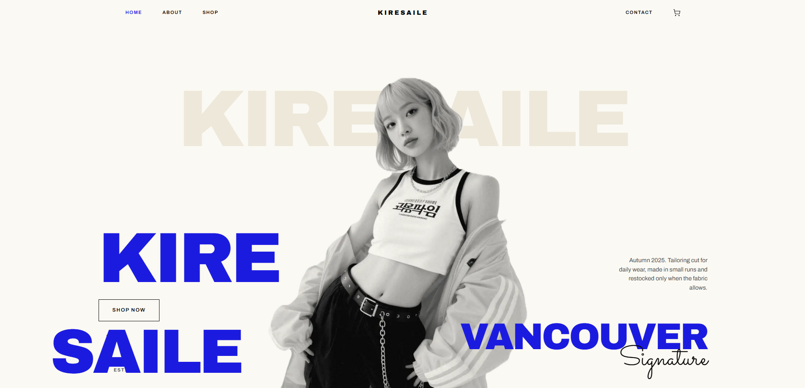
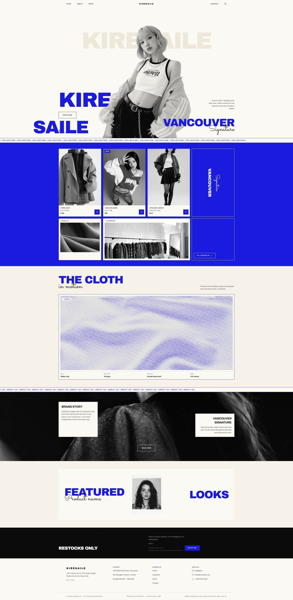

# KIRESAILE — Loja de Roupa Feminina

Uma landing page de e-commerce desenvolvida com Next.js 16, TypeScript e Tailwind CSS 4, apresentando a KIRESAILE — uma marca de moda feminina fictícia criada para este projeto de portfólio — com um vídeo de tecido processado em tempo real por um fragment shader WebGL, carrinho de compras funcional e design editorial em preto, branco e azul elétrico.



🔗 **[Ver projeto ao vivo](https://erikeliasv.github.io/KIRESAILE/)**

---

## Visão Geral

Site institucional e de vendas single-brand que simula a experiência de um e-commerce de moda: hero editorial com retrato em tom de cinza, vitrine de coleção, seção de tecido com um shader WebGL em tempo real, página de coleção com filtros, página de produto com carrinho, e um rodapé com newsletter.

O nome **KIRESAILE** é o meu próprio nome — **Erik Elias** — invertido (Erik → *Kire*, Elias → *Saile*). O projeto não representa uma marca real; é um exercício de portfólio para demonstrar front-end, design de interface e programação de shaders aplicados a um caso de uso de e-commerce.

### Screenshots

> Crie uma pasta `screenshots/` na raiz do projeto e salve cada imagem com o nome indicado. Sugestão: navegador em ~1440px de largura, tema claro, sem o cursor do mouse visível.

| Seção | Arquivo | O que fotografar |
|-------|---------|-------------------|
| Hero | `screenshots/hero.png` | Topo da Home (`/`), assim que a página carrega: o wordmark "KIRESAILE" fantasma atrás da cabeça do retrato, "KIRE / SAILE" em azul, botão "Shop now" e "VANCOUVER Signature" à direita. |
| Vitrine da coleção | `screenshots/collection-wall.png` | Role a Home até a faixa azul "COLLECTION" — os 3 cards de produto, o painel "Vancouver Signature", os blocos "Quality" e "Lookbook" e o botão "All products". |
| Tecido em tempo real | `screenshots/fabric-shader.png` | Seção "THE CLOTH" na Home, com o vídeo rodando — deve mostrar o efeito de pontos (halftone) sobre o tecido, não o vídeo cru. |
| Brand story | `screenshots/brand-story.png` | Seção seguinte na Home: a foto do casaco em tela cheia com os cartões "Brand story" e "Vancouver signature" sobrepostos. |
| Página da coleção | `screenshots/collection-page.png` | Acesse `/collection` — mostre os chips de filtro (All, Outerwear, Tailoring...), o seletor de ordenação e a grade de produtos. |
| Página de produto | `screenshots/product-page.png` | Abra qualquer produto (ex: `/product/kire-coat`) — mostre a foto, nome, preço, seletor de tamanho e os botões "Add to bag" / "View bag". |
| Carrinho | `screenshots/cart-drawer.png` | Com um item adicionado, clique no ícone de sacola no header para abrir o drawer lateral — mostre o item, as opções de frete e o total. |
| Rodapé | `screenshots/footer.png` | Final de qualquer página — mostre as colunas de lojas/links/redes sociais e a linha "Portfolio project — Erik Elias, 2026". |
| Página completa | `screenshots/full-page.png` | Screenshot de página inteira (full-page) da Home, do topo até o rodapé. |

---

## Funcionalidades

- **Hero editorial** — retrato tratado em duotone (tons de cinza/creme), wordmark gigante posicionado atrás da cabeça do modelo, tipografia grande sobreposta à imagem
- **Fragment shader em tempo real** — um vídeo de tecido é lido como `THREE.VideoTexture` e processado a cada frame por um shader GLSL customizado (pixelização, halftone/dithering Bayer, grão animado), rodando via `three.js` + `@react-three/fiber`
- **Vitrine de coleção** — grade assimétrica com cards de produto, painel de marca e blocos de mídia, seguindo um design system de grid nunca uniforme
- **Coleção filtrável** — chips de categoria e ordenação por preço (`/collection`)
- **Página de produto** — seleção de tamanho, abas de detalhes/tecido/envio, produtos relacionados
- **Carrinho de compras** — drawer lateral com opções de frete, embrulho para presente, total dinâmico e toast de confirmação
- **Marquees infinitos** — faixas "COLLECTION" e "ABOUT US" com scroll contínuo, resistentes à preferência de movimento reduzido do sistema
- **Cache-busting automático de mídia** — cada imagem local carrega um parâmetro de versão baseado na data de modificação do arquivo, então trocar uma foto no disco atualiza o site na hora, sem reiniciar o servidor
- **Newsletter e formulário de contato** — captura de e-mail com estado local

---

## Tecnologias

| Tecnologia | Versão |
|------------|--------|
| Next.js | 16.3.2 |
| React | 19.2.8 |
| TypeScript | 5+ |
| Tailwind CSS | 4 |
| three.js | 0.185.1 |
| @react-three/fiber | 9.7.0 |
| ESLint | 9+ |

---

## Como Executar

```bash
# Clonar o repositório
git clone https://github.com/ErikEliasV/KIRESAILE.git

# Entrar na pasta do projeto
cd KIRESAILE

# Instalar dependências
npm install

# Rodar em modo de desenvolvimento
npm run dev
```

Acesse [http://localhost:3000](http://localhost:3000) no navegador.

### Outros comandos

```bash
# Build de produção (gera o site estático em ./out)
npm run build

# Servir o build estático localmente para conferir antes do deploy
npm start

# Executar lint
npm run lint
```

O projeto é publicado como site estático (`output: "export"`) — não roda `next start`. A cada push em `main`, o GitHub Actions builda e publica automaticamente em [https://erikeliasv.github.io/KIRESAILE/](https://erikeliasv.github.io/KIRESAILE/) (veja `.github/workflows/deploy.yml`).

---

## Estrutura do Projeto

```
KIRESAILE/
├── .github/
│   └── workflows/
│       └── deploy.yml              # build + deploy automático no GitHub Pages
├── public/
│   ├── .nojekyll
│   └── media/
│       ├── product-01.jpg ... product-06.jpg
│       ├── girl-model-mono-edit.png
│       ├── detail-yarn.jpg, detail-knit.jpg
│       ├── lookbook-rack.jpg, story-coat.jpg, featured-portrait.jpg
│       └── video_tecido.mp4
├── app/
│   ├── globals.css
│   ├── layout.tsx
│   ├── page.tsx                  # Home
│   ├── not-found.tsx
│   ├── collection/
│   │   └── page.tsx
│   └── product/
│       └── [slug]/
│           └── page.tsx
├── components/
│   ├── cart-context.tsx
│   ├── cart-drawer.tsx
│   ├── collection-grid.tsx
│   ├── fabric-section.tsx
│   ├── newsletter-form.tsx
│   ├── product-detail.tsx
│   ├── site-header.tsx
│   ├── site-footer.tsx
│   ├── shader-film/
│   │   ├── index.tsx              # <video> → VideoTexture → EffectComposer → <Canvas>
│   │   └── fabric-shader.ts        # o fragment shader GLSL
│   └── ui/
│       ├── button.tsx, icon.tsx, marquee.tsx
│       ├── media-frame.tsx, product-card.tsx, section-heading.tsx
├── lib/
│   ├── catalog.ts                  # dados do catálogo de produtos
│   ├── asset-version.ts            # cache-busting de mídia local
│   └── versioned-catalog.ts
├── package.json
├── tsconfig.json
├── next.config.ts
└── tailwind / postcss / eslint configs
```

---

## Preview Completa



---

## Autor

Desenvolvido por **Erik Elias**

[](https://www.linkedin.com/in/erik-elias-varela-de-sousa-731363310/)
[](https://erikeliasv.github.io/portfolio/en)

---

## Licença

Este projeto é apenas para fins educacionais e de portfólio. KIRESAILE é uma marca fictícia, criada exclusivamente para este trabalho — não representa nenhuma empresa real. As fotografias de produto e de detalhe usadas como placeholder são de fotógrafos do [Unsplash](https://unsplash.com), usadas sob a licença Unsplash para fins não comerciais e de demonstração.
